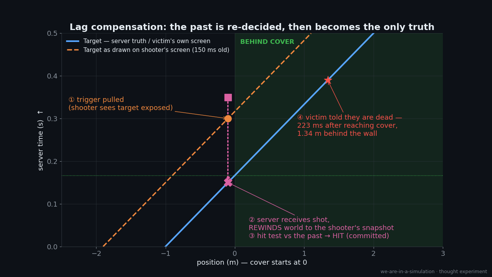
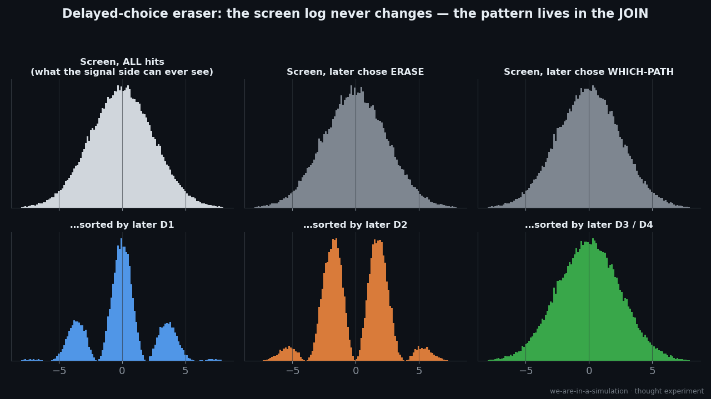
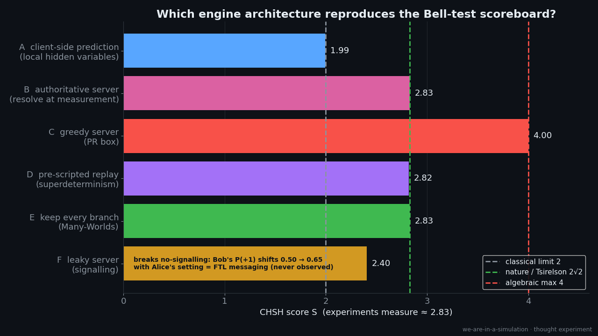
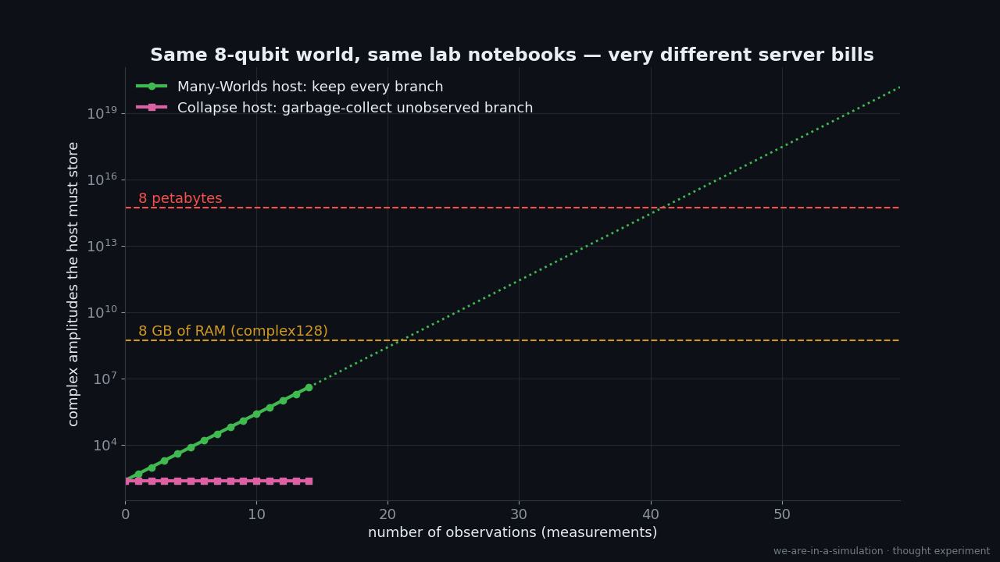

# Experiment 001: Collapse as Rollback

> *In a shooter, you can die behind a wall. The server rewound time, checked the shot against where
> you **were**, and made that the truth. Is the quantum measurement problem the same kind of thing?*

**Status:** sims done · write-up drafted · prior art: see [`research/prior-art.md`](research/prior-art.md)
**Labels:** see [METHODOLOGY](../../METHODOLOGY.md) — [PHYS] [CS] [SIM] [ANALOGY] [SPEC] [COUNTER]

---

## 1. The observation

[SPEC] Wave-function collapse looks a lot like a game system doing probabilistic work. When an
"observation" happens, the engine takes a snapshot, resolves the outcome, and from then on that
outcome is the one truth, whatever any single participant had experienced before.

[CS] This is how **lag compensation** works in competitive shooters (Source engine / Counter-Strike,
Overwatch, Valorant, etc.):

1. The shooter's screen shows the target **in the past**, by roughly one-way latency plus an
   interpolation buffer.
2. The shooter fires at that old image.
3. The server receives the shot late, **rewinds** every hitbox to the moment the shooter was
   seeing, tests the hit against that historical snapshot, and **commits** the result.
4. The victim is told they're dead, often after they reached cover on their own screen.

This experiment asks how far that analogy holds, and it sets three engine designs against each other,
matching the three main families of interpretation:

| engine design | interpretation it mirrors |
|---|---|
| **Authoritative server resolves at observation** | collapse (Copenhagen-style, objective-collapse models) |
| **Keep every speculative branch, never delete** | Many-Worlds (Everett) |
| **Deterministic lockstep: one seed, replay-exact** | superdeterminism / 't Hooft's cellular-automaton view |

## 2. The analogy table: where it fits and where it breaks

| quantum concept | engine concept | fits because… | breaks because… |
|---|---|---|---|
| superposition | client-side prediction / speculative candidate states | several possible states are carried forward before one is confirmed | [COUNTER] quantum amplitudes **interfere** with each other. Speculative game states never do. |
| measurement / collapse | server-authoritative resolution + commit | one outcome gets picked and broadcast as canonical | [COUNTER] no measurable "latency" to collapse has ever been observed |
| delayed-choice experiments | lag compensation resolving an event in the past | the "decision" seems to depend on something that happens later | [COUNTER] in games the victim **sees** a contradiction (death behind the wall). In QM no observer ever sees one. See Sim 2 |
| entanglement | two entities pointing at one shared server-side record | correlated outcomes at any distance, from one resolution | fits surprisingly well. See Sim 3 |
| no-signalling | anti-cheat: clients can't read server state | correlations exist, but neither side can use them to send a message | [PHYS] this is a hard constraint; any leak would be an FTL channel |
| decoherence | state replicated to many clients so it can't be rolled back anymore | once which-path info spreads into the environment, interference is gone for good | [SPEC] the "rollback window" closes once state is broadcast. Compare Zurek's *quantum Darwinism* |
| Born rule (prob = \|amplitude\|²) | server RNG weighted by some function of state | outcomes are random but weighted | [COUNTER] the analogy doesn't explain *why* the weight is the square |
| decoherence (continued) | **Time Warp** (Jefferson 1985): optimistic distributed simulation rolls back on late messages, but only down to *Global Virtual Time*. Older states are committed, and their history is freed ("fossil collection") | there's a hard horizon behind which history can't be rolled back anymore | [SPEC] our mapping, with no indexed prior art found. It's a much closer CS ancestor than FPS netcode, because the rollback never overrides committed records |
| Many-Worlds | never garbage-collect any branch | nothing is ever discarded | cost grows exponentially. See Sim 4 |
| superdeterminism | deterministic lockstep / demo replay (RTS games, Doom demos) | same seed → same history, bit for bit | [COUNTER] experimenters' "free" setting choices must be pre-correlated with the particles |

## 3. The sims (runnable proofs-of-mechanism)

All numbers below are printed by the scripts in [`sims/`](sims/). Run `make exp001` from the repo root.

### Sim 1: Lag compensation, a space-time view · [`sims/lag_compensation.py`](sims/lag_compensation.py)

[SIM] With shooter one-way latency 50 ms, 100 ms interpolation (Source default `cl_interp 0.1`) and
victim latency 40 ms, a target sprinting at 6 m/s is told it's dead **223 ms after reaching cover,
1.34 m behind the wall**. The server rewound **200 ms** to resolve the shot.

[SIM] How often a death "happens behind cover" from the victim's point of view (target exposed for 500 ms):
**34% / 40% / 48% / 58%** at shooter RTT 30 / 60 / 100 / 150 ms. With only 250 ms exposure it's
**68–100%**. Retroactive truth isn't a bug in this design. It's how the design works.

Clip: `output/lagcomp_three_views.mp4` (shooter / server / victim, 12× slow motion).

### Sim 2: Delayed-choice quantum eraser as an event log · [`sims/delayed_choice_eraser.py`](sims/delayed_choice_eraser.py)

This is the closest real experiment to "the future decides the past". It's an idealised version of
Kim et al. (1999). The signal photon hits the screen **first**. Its entangled twin is measured
**later**, and a random beam-splitter decides whether that measurement reveals which slit
(D3/D4) or erases it (D1/D2).

- [SIM] Fringe contrast on the raw screen: **0.01**, whatever is chosen later.
- [SIM] Screen hits sorted by later D1 / D2: contrast **1.00 / 0.99** (fringes / anti-fringes).
- [SIM] No-signalling check: χ² = **40.5 on 39 dof**. The later choice leaves **no trace** on the screen.
- [SIM] Most important: the sim generates events **strictly in time order**. It writes the screen
  hit, then later samples the idler conditioned on the already-written hit. **No rewind, no edit**,
  and every statistic comes out right.

**What this does to the analogy:** a literal *rollback* isn't needed. What *is* needed is that
something keeps a **joint record** of both photons, and later outcomes are drawn consistently with
that record. In netcode terms, it's less "rewind and re-simulate" and more "the server holds the
authoritative joined log, and clients only ever see their own slice". The "retroactive" pattern
lives only in the **join** of the two logs (coincidence counting), which no single observer can
see on their own. That's the key *disanalogy* with lag compensation: in games, the victim **sees**
the contradiction. In nature, nobody does.

Clip: `output/eraser_relabel.mp4`. Grey dots land, then get coloured later by their partner's
result. The dots never move.

### Sim 3: Bell test, which engine architecture can hit the scoreboard? · [`sims/bell_server_architectures.py`](sims/bell_server_architectures.py)

[PHYS] Loophole-free Bell tests (2015, Nobel 2022) measure a CHSH score of about **2√2 ≈ 2.83**.

| architecture | S | Bob's marginal P(+1) given Alice's setting a0 / a1 |
|---|---|---|
| A. client-side prediction (local hidden variables) | **1.99** (exhaustive max over all 16 answer tables: **2**) | 0.50 / 0.50 |
| B. authoritative server resolves at measurement | **2.83** | 0.50 / 0.50 |
| C. greedy server (PR box) | **4.00** | 0.50 / 0.50 |
| D. pre-scripted replay (superdeterminism) | **2.82** | 0.50 / 0.50 |
| E. keep every branch (Many-Worlds, exact weights) | **2.83** | 0.50 / 0.50 |
| F. leaky server | 2.40 | **0.50 / 0.65** ← signalling |

Observations:

1. [SIM] **Pre-loading answers into the particles (client-side prediction) can't win.** That's Bell's theorem.
2. [SIM] Three very different architectures hit the real number: a **central server with global
   state access**, a **pre-written script**, and **keeping every branch**. Those are the three
   big interpretation families. From the inside they're indistinguishable.
3. [ANALOGY] A central game server is **nonlocal for free**. It doesn't care how far apart two
   entities are in the game world. "Spooky action at a distance" is how every MMO works.
   *(Prior art: Campbell, Owhadi, Sauvageau & Watkinson 2017 make this point explicitly.)* The minimum
   "server traffic" is known too: Toner & Bacon (2003) showed **one classical bit** of hidden
   communication per pair is enough to reproduce these correlations.
4. [SIM] B and D are **the same arithmetic**. The only difference is *where and when* the
   information lives: at a server at measurement time, or in a seed at the start. Statistics can't
   tell them apart.
5. [SPEC/open] **The server is holding back.** The same architecture can score 4 (C) and still never
   leak a signal. Nature stops at 2√2 (Tsirelson's bound). Why an engine would be capped there
   is a genuine open question in physics (see "information causality" in prior-art.md).
6. [PHYS] The engine must **hide its nonlocality** (F shows what a leak looks like). Whatever
   reality is, its anti-cheat is perfect.

### Sim 4: What each interpretation costs to host · [`sims/branching_cost.py`](sims/branching_cost.py)

The same 8-qubit world gets scrambled and observed once per round:

- [SIM] After 14 observations the **Many-Worlds host stores 4,194,304 amplitudes. The collapse host
  stores 256.** Each observation doubles the MWI bill. At about 266 doublings it passes 10⁸⁰, the
  number of atoms in the observable universe.
- [SIM] The inhabitants' lab notebooks agree across engines. The distribution of 5-outcome records has
  total-variation distance **0.008** between MWI branch weights and collapse frequencies
  (sampling noise ≈ 0.014).
- [SIM] The deterministic engine replays bit-exact: seed 7 → `(0, 0, 1, 1, 1)` twice.

[ANALOGY] **Collapse behaves like garbage collection.** Once a branch has decohered, nothing inside
the world can ever interfere with it again. It's unreachable, and a collector would reclaim it.

[COUNTER] That's the cost for a *naive state-vector host*. Clever representations (tensor
networks, stabiliser methods, lazy evaluation) change the constants a lot. Many-Worlds
proponents would also say branches don't "cost" anything, because the wavefunction is simply what
exists. The cost argument only has force **if** there's a host with finite resources, which
assumes the thing being asked.

## 4. Scoreboard

| | observation | label |
|---|---|---|
| ✅ fits | Outcomes are resolved into one canonical record that everyone then agrees on | [PHYS]/[ANALOGY] |
| ✅ fits | Correlations act like shared server-side state: nonlocal, yet un-exploitable | [SIM] |
| ✅ fits | Collapse-style engines are exponentially cheaper to host than keep-everything engines | [SIM] |
| ✅ fits | Delayed-choice statistics look "retroactive" only in the joined log, like server-side annotation | [SIM] |
| ❌ breaks | Quantum branches **interfere**. Game predictions never do. | [COUNTER] |
| ❌ breaks | Lag compensation produces **visible contradictions** for the victim. Nature never does. | [COUNTER] |
| ❌ breaks | The eraser needs **no rewind at all**, just a joint record. "Rollback" is stronger than the data require. | [SIM] |
| ❌ breaks | An engine that could *re-roll* outcomes until it liked them would hand its inhabitants absurd computing power (postselection: PostBQP = PP, Aaronson 2005). Whatever nature does, it isn't free re-rolls. | [COUNTER] |
| ❌ breaks | Wigner's-friend no-go theorems: a single authoritative history across all observers requires giving up locality (or another assumption). The "one server truth" picture has a price. | [COUNTER] |
| ❓ open | Why would a server that *could* score 4 cap itself at 2√2? | [SPEC] |
| ❓ open | Why is the RNG weighted by amplitude **squared**? | [SPEC] |

## 5. What could tell the engines apart? (testable directions)

[SPEC] Collapse, Many-Worlds and superdeterminism make the same predictions for standard quantum
mechanics, which is why the question is hard. But a **resource-limited** host suggests a specific
kind of *modification*: **garbage-collect big branches first**. The more particles in a
superposition, the sooner you'd prune it. That's exactly the shape of **objective-collapse
models** (GRW / CSL, Diósi–Penrose), where collapse rate grows with mass or particle number. Those
models *are* testable: matter-wave interferometry with ever-larger molecules, and searches for the
tiny spontaneous heating or radiation they predict. The "compute-budget" framing turns an
interpretation question into a parameter search that experiments are already running. Current
experimental bounds are in `research/prior-art.md`.

## 6. Prior art and novelty

See [`research/prior-art.md`](research/prior-art.md) for the verified bibliography, the searches
run, and coverage caveats.

| part of the idea | status |
|---|---|
| measurement as "render on demand" / lazy evaluation | **well anticipated**: Bostrom 2003; Campbell *My Big TOE* 2003; Campbell et al. 2017; Virk 2019 |
| simulator "rewinds and re-runs" | **anticipated in spirit**: Bostrom 2003 ("skip back a few seconds and rerun"), though as anomaly repair, not measurement |
| a central server explains Bell nonlocality | **anticipated**: Campbell et al. 2017 |
| Many-Worlds framed as computational extravagance | **anticipated**: Deutsch 1997; Aaronson; Carroll; Vaidman |
| retro-causal "handshake" structure | **overlapping physics**: Cramer's transactional interpretation, Aharonov's two-state vector formalism, Price & Wharton |
| **lag compensation / "favor the shooter" / rollback netcode / Time Warp as a model of measurement and delayed choice** | **no indexed prior art found** |
| **netcode-style cost comparison: keep-every-branch vs bounded-buffer-and-commit vs lockstep replay** | **no indexed prior art found** |

The game side already talks this way. Valve's Yahn Bernier (2001) described lag compensation as
"taking a step back in time" and acknowledged its "paradoxes", without drawing a physics link.
Reddit, Discord, X and video transcripts couldn't be searched, so **public wording should be "we
found no published or indexed source making this mapping", never "this is new."**

## 7. Outputs for publishing

- Social drafts: [`social/posts.md`](social/posts.md)
- Video script and shot list: [`video/script.md`](video/script.md), [`video/shots.json`](video/shots.json)
- Rough cut: `./video/build.sh` → `video/build/animatic.mp4` (+ `.srt` captions, + vertical 9:16 cut)
