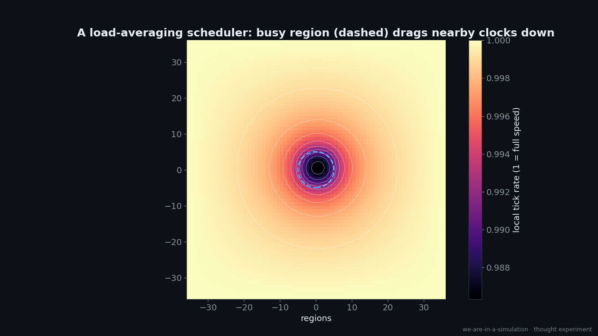
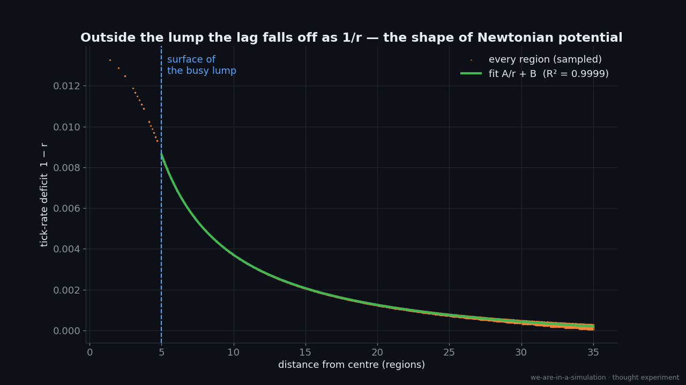
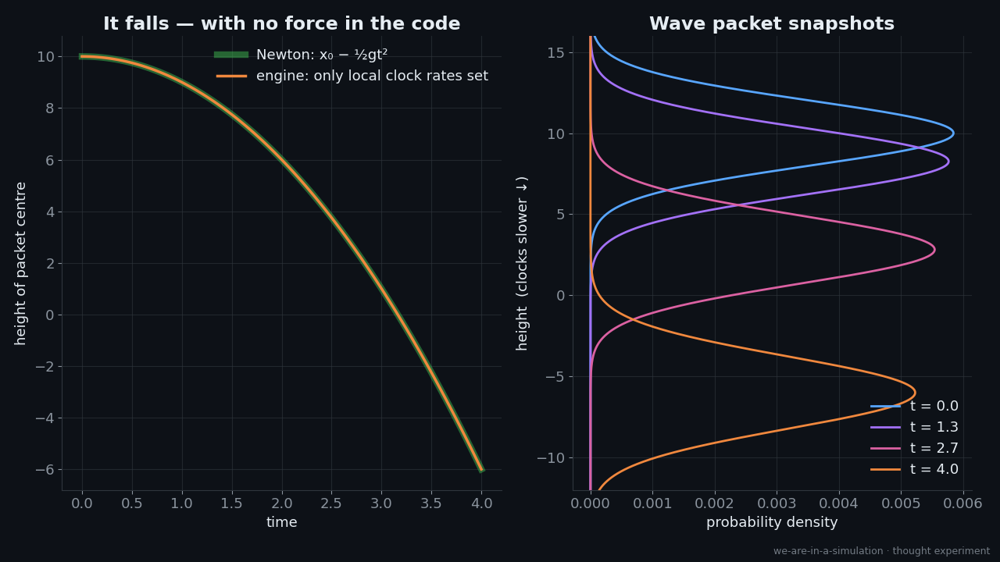
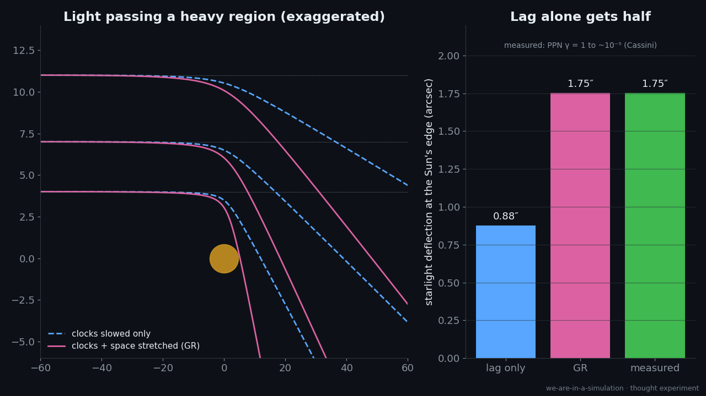
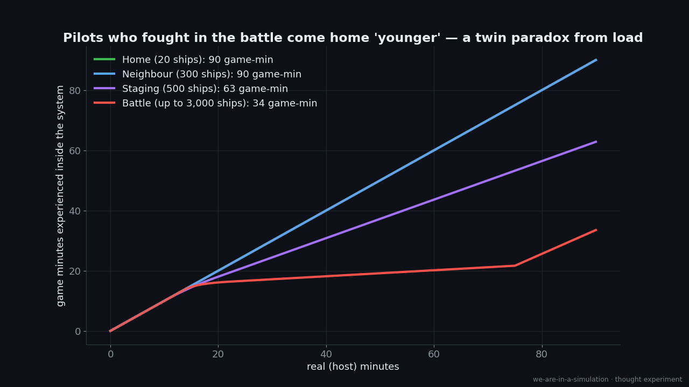
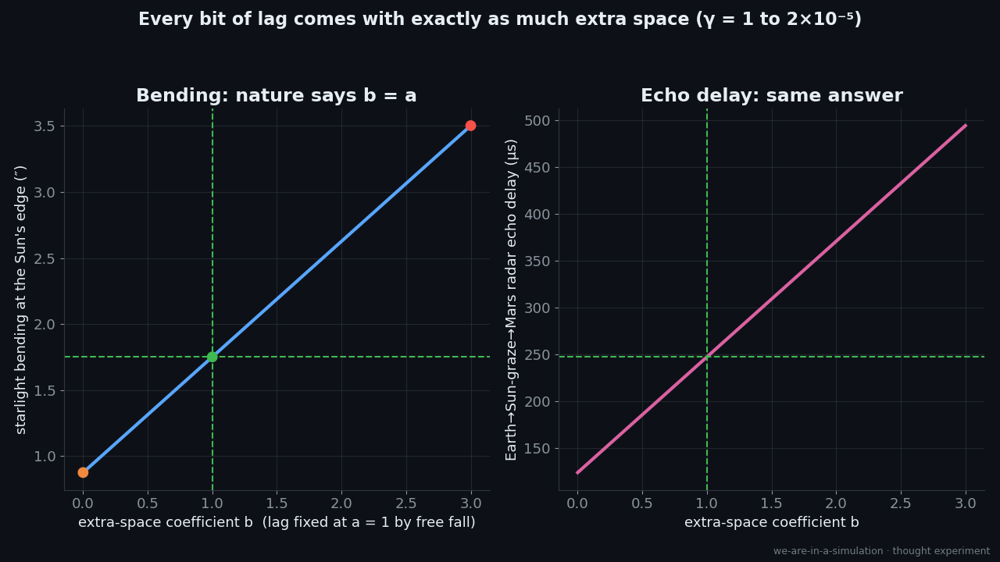

# Experiment 002: Gravity as Compute Load

> *The more stuff in a region, the longer it takes to compute that region, so time there runs slow.
> Is gravity what processing lag looks like from the inside?*

**Status:** sims done · write-up drafted · prior art: see [`research/prior-art.md`](research/prior-art.md)
**Labels:** see [METHODOLOGY](../../METHODOLOGY.md) — [PHYS] [CS] [SIM] [ANALOGY] [SPEC] [COUNTER]

---

## 1. The observation

[SPEC] Gravity might be a processing bottleneck. Regions dense with matter cost more to compute, so
they update less often, and things (including light) slow down there.

[PHYS] Clocks really do run slower closer to mass. GPS satellites correct for it every day, and optical
clocks detect it across height differences of about a millimetre. In the weak-field limit of
general relativity, a clock's rate is ≈ 1 + Φ/c², where Φ is the Newtonian potential.

[CS] Game servers really do slow time in overloaded regions. **EVE Online's Time Dilation (TiDi)**
slows a star system's clock (down to 10%) when a battle overloads its server node, so the simulation stays
correct instead of dropping actions.

**Credit first:** this idea has been proposed before. Whitworth (2008, 2010) wrote that "relativity
effects could then arise from local processing overloads". Alagoz (2010) modelled space as having a
fixed information-processing capacity per volume, with a capacity gradient producing force and
bending light. Lee (2025) proposed an optical-clock test. Vopson (2025) links gravity to
computation through a *different* mechanism (information compression). What this experiment adds
is **runnable models** and a **quantitative check against measured constraints**. We found no prior
work that did either.

The question is whether "regional lag" can do what gravity does: make clocks slow in the right
*shape*, make things *fall*, and bend light by the *measured amount*.

## 2. The chain of argument, link by link

```
 mass-energy in a region ──(1)──▶ compute load ──(2)──▶ local tick-rate deficit
                                                              │
                     (4) light bends ◀──(3)── things fall ◀───┘
```

| link | claim | status |
|---|---|---|
| (2) load → tick-rate *shape* | a neighbour-averaging scheduler gives a 1/r lag field, like Newton | ✅ [SIM] G1, but by construction |
| (3) tick-rate gradient → falling | only setting local clock rates makes matter fall at exactly g | ✅ [SIM] G2A, and this is real GR |
| (4) tick-rate gradient → light bending | lag alone bends light by only **half** the measured amount | ❌ [SIM] G2B, so space must "stretch" too |
| (1) mass-energy → load | why would cost track *energy* and not *complexity*? | ❓ see §5 |

## 3. The sims

### Sim G1: A scheduler whose lag field obeys Poisson's equation · [`sims/lag_field.py`](sims/lag_field.py)



**Engine rule.** Every region sets its tick rate to the *average of its neighbours' rates* (so adjacent
regions stay in step and can keep exchanging boundary data) *minus a penalty for its own load*.
Far-away empty space runs at full speed.

[CS] This isn't made up for the occasion. Keeping neighbouring partitions' clocks close is the
central problem of **parallel discrete-event simulation**. In conservative schemes, a busy logical
process holds back its neighbours' local virtual time. The averaging rule is the simplest smooth
version of that coupling.



- [SIM] Outside the busy lump, the tick-rate deficit falls off as **A/r with log-log slope −1.000**
  (R² = 0.9999). That's the shape of the Newtonian potential.
- [SIM] The fitted A = **0.0492** matches the analytic Poisson prediction 6αM/(4π) to three figures.
- [COUNTER] **This is a construction, not a discovery.** *Any* local averaging process with sources
  obeys Poisson's equation. What the sim shows is that a reasonable-looking scheduler reproduces
  gravity's *shape*. It doesn't show that nature uses one.
- [COUNTER] A relaxation scheduler settles *diffusively*. Real gravity changes propagate as
  **waves at the speed of light** (LIGO; GW170817). A faithful engine would need a
  second-order-in-time (wave-like) scheduler. That's a design constraint, not a fatal flaw.

Clip: `output/lagfield_relax.mp4`, showing the lag spreading out tick by tick.

**One objection this model handles.** Gravitational time dilation tracks the *potential*, not local
density. A clock at the centre of the Earth is the *most* slowed, yet it feels no force. GPS clocks
in orbit, above mostly empty space, run *fast*. A naive "busy region = slow region" model (like
TiDi) gets this wrong. The neighbour-coupled scheduler gets it right: in the slice above, the
deficit is largest at the centre, where the gradient (the pull) is zero, and it stretches smoothly
far outside the lump.

### Sim G2A: Only the clocks are set, and things fall · [`sims/tick_gradient_motion.py`](sims/tick_gradient_motion.py)



A quantum particle carries an internal clock: its phase turns at the Compton rate mc²/ħ. The only rule
we give the engine is **advance each point's clock at the local tick rate**, slower lower down.
There's no force and no potential in the code.

- [SIM] The wave packet falls **16.00** units in t = 4.0. Newton's ½gt² = **16.00**. The maximum
  deviation from the free-fall parabola is **2.6 × 10⁻¹⁴**.
- [PHYS] This is standard weak-field GR, not a new idea. Czarnecka & Czarnecki (2021, *Am. J. Phys.*)
  derive free fall exactly this way, as matter waves refracting toward slower clocks. Gould (2016)
  says "it is primarily the warping of time, not space, that causes a ball to fall." For slow-moving matter, essentially *all* of
  Newtonian gravity lives in the time–time part of the metric, meaning the gradient in clock rates.
  Things fall toward where time runs slower.
- [PHYS] Scale: on Earth the clock-rate difference is g/c² ≈ **1.1 × 10⁻¹⁶ per metre**. That's all it
  takes to hold you to the floor.

Clip: `output/tick_fall.mp4`.

### Sim G2B: Light bending, where lag gets exactly half · [`sims/tick_gradient_motion.py`](sims/tick_gradient_motion.py)



- [SIM] Slowing clocks also slows light, so rays refract toward busy regions (lensing as refraction).
- [SIM] For a ray grazing the Sun: **lag-only model 0.876″, GR 1.751″**.
- [PHYS] Measurement agrees with GR (PPN parameter γ = 1 to about 10⁻⁵, Cassini). The lag-only model is
  **Einstein's 1911 prediction** (printed as 0.83″, ≈0.87″ with modern constants), which was off by a factor of 2. He fixed it in 1915 by adding
  the curvature of *space*.
- **Consequence for the hypothesis:** "things run slower" isn't enough. The engine must also change
  the **geometry of the grid** near mass: more "room" (more cells, or longer paths) near heavy
  regions.
- [SPEC] A game-engine reading: **adaptive mesh refinement**. Engines and astrophysics codes refine
  the grid where there's more going on. If inhabitants measure distance by counting cells, a
  refined region contains *more distance* than it looks from outside. So "lag + refinement"
  would be the full analogy: slower ticks **and** a finer grid near mass. That's untested
  speculation, and we list it only as the next thing to model.
  [COUNTER] In real AMR codes, refined patches take *smaller, more numerous* timesteps to keep pace.
  Their simulated time doesn't fall behind; they just cost more host time. Real engines absorb
  load instead of turning it into lag.

### Sim G3: The engineered precedent, MMO time dilation · [`sims/tidi_shards.py`](sims/tidi_shards.py)



- [SIM] Fixed budget per node and ~N² interaction cost give time dilation floored at 10%. In a 90-minute
  battle the **battle system experiences 33.5 game-minutes**, staging 62.8, and home the full 90.
- [ANALOGY] Pilots who fought come home "younger". It's a twin paradox caused by server load.
- [COUNTER] TiDi is a **step function per shard**, not a smooth 1/r field (G1 fixes that with
  neighbour coupling). TiDi also tracks **activity** (interactions), not mass. An idle
  asteroid costs nothing, but in physics an idle rock gravitates like any other.

## 4. Scoreboard

| | observation | label |
|---|---|---|
| ✅ fits | Clocks run slower near mass, and only *relative* rates are observable (a global slowdown would be invisible from inside, just like host lag) | [PHYS]/[ANALOGY] |
| ✅ fits | A neighbour-coupled load scheduler produces a 1/r lag field | [SIM] |
| ✅ fits | A clock-rate gradient alone makes matter fall at exactly g | [SIM]/[PHYS] |
| ✅ fits | Black holes: clock rate → 0 at the horizon (as seen from outside), and they hold the *maximum* information a region can store (Bekenstein bound). That looks like a region at 100% compute saturation. | [ANALOGY] |
| ✅ fits | Real engines already do this: EVE Online TiDi | [CS] |
| ❌ breaks | Lag alone bends light by half the measured amount. Space must also be "stretched". | [SIM]/[PHYS] |
| ❌ breaks | Gravity depends only on mass-energy, not on complexity, composition or activity (equivalence-principle tests reach ~10⁻¹⁵) | [PHYS]/[COUNTER] |
| ❌ breaks | A relaxation scheduler doesn't produce gravitational waves at c | [COUNTER] |
| ⚠️ constraint | No granularity seen: gravitational redshift is smooth across a 1 mm atom cloud (Bothwell et al. 2022). Any "tick" is far below that scale. | [PHYS] |
| ⚠️ constraint | Gravity adds *linearly* with mass, while game compute usually scales with *interactions* (~n²). Load must be per-particle, not per-pair. | [COUNTER] |
| ❓ open | Why would compute cost be proportional to *energy*? | [SPEC] §5 |

## 5. The hardest link: why would load track mass-energy?

[COUNTER] If gravity were compute load, you'd naively expect a *complicated* object (a brain, a CPU,
a turbulent fluid) to gravitate more than an equally massive *simple* one (a steel ball).
Equivalence-principle experiments (MICROSCOPE: ~10⁻¹⁵) find no such difference. Gravity
responds to mass-energy and nothing else.

[SPEC] There's one way through, and it comes from physics itself. **Energy is a frequency**
(E = hf). Every massive particle's quantum phase turns at mc²/h, about 10²⁰ times per second for an
electron. If the engine's cost is "phase updates per tick", then load *is* energy, and complexity
doesn't enter at all. A steel ball and a CPU of equal mass have the same number of phase
updates. On this reading, **mass is a tick rate that has to be serviced**. It links Sim G2A (mass
as a clock) to Sim G1 (clocks cost compute).

[COUNTER] The **Margolus–Levitin theorem** says a system with energy E can do at most 2E/(πħ)
operations per second. Physics treats energy as *capacity* to compute, not as a *cost* on some
outside machine. The two readings are mirror images: from inside, energy is processing done; from
the host, it would be processing demanded. Nothing measurable distinguishes them yet.

## 5b. The author's extension: energy makes space (exchange rate 1:1)

Full write-up: [`research/energy-makes-space.md`](research/energy-makes-space.md) · Sim G4: [`sims/space_time_exchange.py`](sims/space_time_exchange.py)



- [SIM] Free fall fixes the lag coefficient a = 1. Light bending and the Earth–Mars radar echo delay fix a + b = 2.
  So **extra space b equals lag a, to 2 parts in 100,000**. Lag-only and space-only both give 0.876″ and
  123.6 µs, the 1:1 split gives **1.751″ and 247.2 µs** (the measured values), and volume-scaling space
  gives twice too much.
- [SPEC] An engine gets 1:1 for free if **a region's tick is a sync signal that has to cross the region's
  cells**. Then more space means proportionally slower ticks. It also makes the speed of light the engine's
  cell-per-tick signal speed, identical for every local observer.
- Novelty: not yet checked (queued).

## 6. Prior art and novelty

See [`research/prior-art.md`](research/prior-art.md) for the verified bibliography, searches run and caveats.

| part of the idea | status |
|---|---|
| time dilation / gravity = local processing overload | **directly anticipated**: Whitworth 2008, 2010; Alagoz 2010 (includes gradient → force and light bending); Lee 2025; many informal posts ("time dilation is lag" is a known meme) |
| gravity as computational optimisation | **different mechanism**: Vopson 2025 (information compression) |
| time dilation as an update-budget effect | **partial**: Wolfram 2024, but for *motion*. For gravity Wolfram goes the other way (more activity, time runs *faster*) |
| slower clocks below → things fall | **textbook physics**: Carroll's GR notes; Epstein 1983; Gould 2016; Czarnecka & Czarnecki 2021 |
| regional slowdown under load in real software | **shipped**: EVE Online TiDi (dev blog April 2011, fully live January 2012); Second Life region time dilation |
| **executable toy models where a load-driven tick-rate field is the only ingredient, measuring fall and force law** | **no prior work found** |
| **neighbour-averaging scheduler → Poisson → 1/r lag field** | **no prior work found** (the maths is standard; its use as a scheduler argument isn't) |
| **quantitative confrontation with γ = 1, equivalence principle, potential-vs-density** | **no prior work found** |
| **EVE TiDi as a worked, citable analogy for gravitational time dilation** | **no citable source found** |

**Public wording:** credit Whitworth and Alagoz as the originators of the core claim. Our contribution
is the models and the scoreboard.

## 7. Outputs for publishing

- Social drafts: [`social/posts.md`](social/posts.md)
- Video script and shot list: [`video/script.md`](video/script.md), [`video/shots.json`](video/shots.json)
- Rough cut: `./video/build.sh` → `video/build/animatic.mp4`
