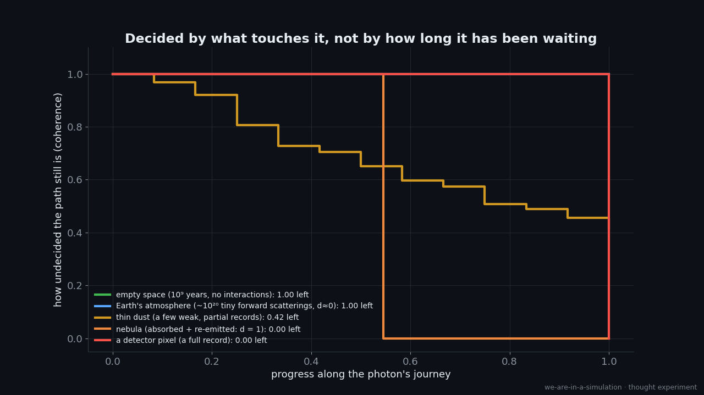
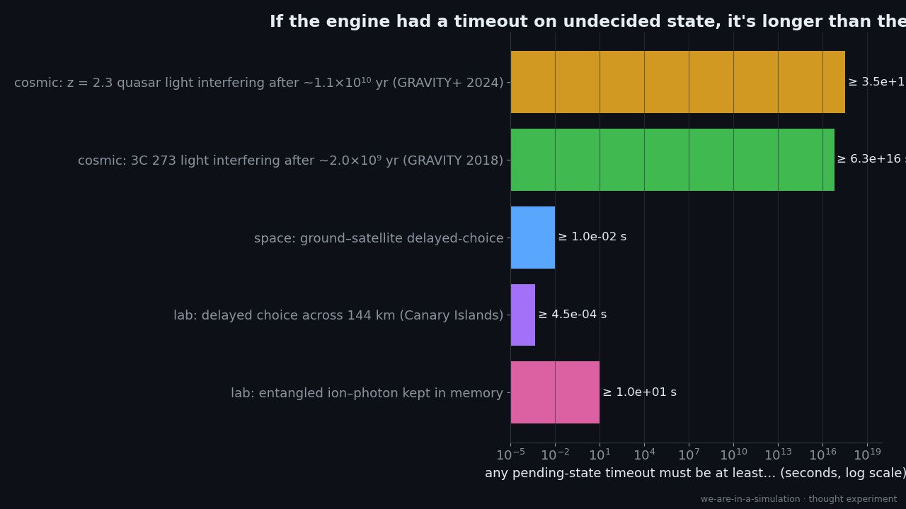

# Experiment 003: When Does the Universe Decide?

> *Light leaves a star a billion years ago, passes through gas, our atmosphere and a lens, and lands in your
> eye. At which point did "the universe" settle where it went? And if it's a simulation, does it have to
> rewind a billion years to do that?*

**Status:** sims done · facts checked ([research](../../thesis/report/research/exp003-005-batchE-facts.md)) · **Builds on:** [Episode 001 / Experiment 001](../001-collapse-as-rollback/)
(rollback, delayed choice, the Bell "server architectures") and [Episode 002 / Experiment 002](../002-gravity-as-compute-load/)
(the engine's tick and the light race).
**Labels:** see [METHODOLOGY](../../METHODOLOGY.md).

## 1. The questions (from the author)

1. When we observe starlight, does that reach back and "decide" something at the star, a billion years ago? If so, a
   simulation would need a huge rollback.
2. If the light interacts along the way (a nebula, the atmosphere), *when* was it decided?
3. Does undecided state have a **timeout**, or does it "dissolve into the background noise" (decoherence)?
4. Is entanglement just **two pointers to the same object**?

## 2. What we find

### No billion-year rollback needed: only a pending field on the photon
[PHYS] The star's side of the emission is recorded straight away by countless interactions inside the star, so
nothing at the star is left undecided. What can stay open is only the **photon's own** state (its path and
polarisation). [ANALOGY] That's **lazy evaluation of one small object**, not a rewind. It's the refined picture from
Episode 001: a *joint record* resolved when read, not "rewind and re-simulate".
*(Callback: Episode 001's delayed-choice eraser needed no rewind either.)*

### Decided by what touches it, not by a clock · [`sims/pending_state.py`](sims/pending_state.py)

- [SIM] Under an **interaction rule** (decoherence), coherence survives empty space and a clear atmosphere
  (coherent forward scattering leaves no record: 1.00 left), is partly eaten by thin dust (0.42 left), and ends
  at a nebula or a detector (0.00). That's the "dissolving into the background noise" idea, made precise: **a
  pending value is committed once enough other things have read or copied it.**
- [ANALOGY] Engine version: a pending write is committed when it's **replicated** to enough readers. Partly
  anticipated: "redundant records / consensus" is the vocabulary of Zurek's **quantum Darwinism** (2009).
  *(Callback: Episode 001's decoherence row, where "the rollback window closes once state is broadcast".)*

### If there were a timeout, it's longer than light's journey across the universe

- [SIM/PHYS] Lower bounds on any "force-commit after T" rule: ≥ 10 s (entangled ion–photon in memory; Drmota et
  al. 2023), and **≥ ~6×10¹⁶ s (~2 billion years)** from 3C 273 light that still interferes between the VLT's
  telescopes (GRAVITY 2018), and **≥ ~3.5×10¹⁷ s (~11 billion years)** from a z = 2.3 quasar (GRAVITY+ 2024).
  The light arrives far less than one photon per coherence time, so each photon's which-telescope path is a
  single-photon superposition.
- [COUNTER] Precise scope: this rules out a timeout that commits *which telescope* the photon reaches. The spatial
  coherence builds up during the trip (van Cittert–Zernike), so a timeout that fixed the photon's position
  early in the journey wouldn't necessarily erase the fringes. Prior art: Lieu & Hillman (2003) already used
  phase coherence over cosmic distances to bound new physics.
- [SPEC] So the engine seems to keep undecided state alive **as long as nothing interacts with it**. That points to
  an interaction-driven commit, not a clock-driven one.

### Entanglement as pointers: a stored value fails, a shared future works · [`sims/shared_future.py`](sims/shared_future.py)
- [SIM] Two particles pointing at a **value fixed at creation** score **S = 2.01**, the classical limit. It's a
  local hidden variable.
- [SIM] Two particles pointing at a **shared, unresolved promise**, resolved by whichever is read first *using
  that reader's angle*, score **S = 2.84**, matching experiment (≈2.83). Each side's own results stay 50/50
  (0.50 / 0.50), so there's **no way to send a message**.
- [ANALOGY] "Entanglement is a shared reference to a future." *(Callback: Episode 001's Bell scoreboard; this is
  the "authoritative server" architecture written as ordinary code.)* Informal prior art: a 2013 HN comment
  compares entanglement to "dereferencing a pointer". "Lazy evaluation" versions are common in informal
  discussion; we found no "promise/future" wording. [PHYS] Cost: a shared future needs hidden communication
  between the two ends. Toner & Bacon (2003) showed one bit per pair is enough.

## 3. Scoreboard

| | observation | label |
|---|---|---|
| ✅ fits | Undecided state behaves like a lazily evaluated field on the photon, with no rewind of the source | [PHYS]/[ANALOGY] |
| ✅ fits | Commit is triggered by interaction/replication (decoherence), not by elapsed time | [PHYS]/[SIM] |
| ✅ fits | Entanglement behaves exactly like a shared future resolved on first read | [SIM] |
| ⚠️ bound | Any timeout on which-path pending state must be ≥ ~11 billion years (for isolated photons) | [PHYS] |
| ❓ open | Why is there no timeout? A real engine would garbage-collect stale pending state. (See Experiment 004: the heat cost of deleting it.) | [SPEC] |

## 4. Episode seed: "When does the universe decide?"
Starlight's billion-year trip rendered as a single glowing pending value, passing through gas and air untouched,
decided by a pixel. Callbacks: the delayed-choice screen (Ep 1), the light race (Ep 2), the Bell scoreboard (Ep 1).
