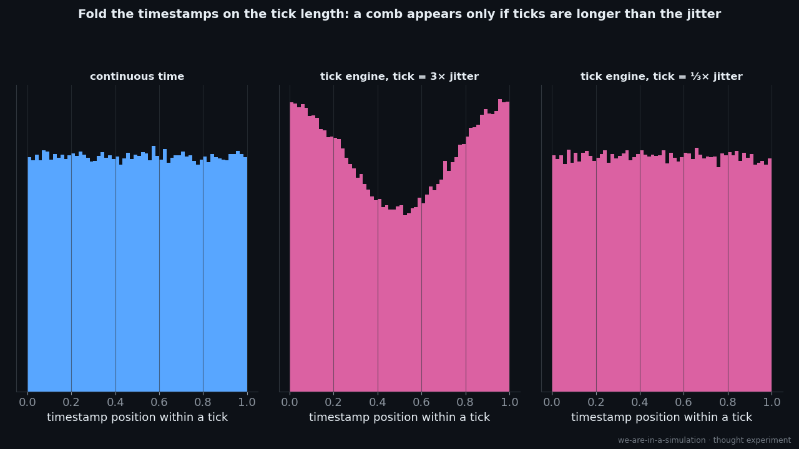
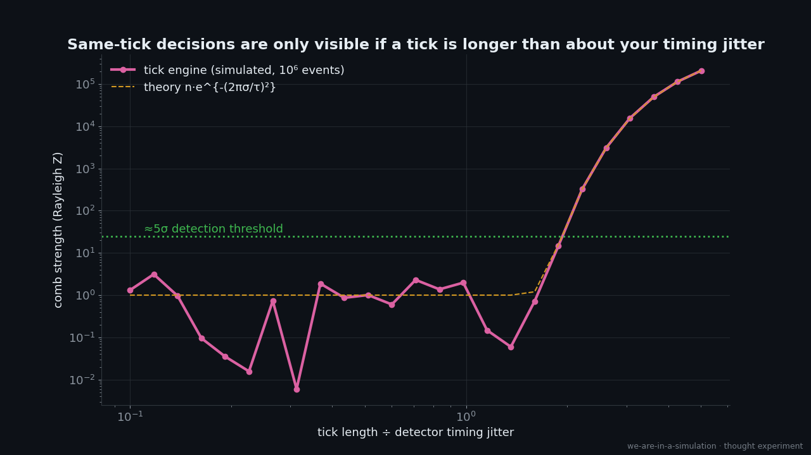

# Experiment 005 (series): Catching the Engine: Tests, Not Resemblances

> *So far we've shown that physics **resembles** engineering. That's correlation. This series flips the question:
> if the universe runs on an engine, what would an engine do that **nothing else** would, and has anyone looked?*

Each test gets: the **engine behaviour** → the **signature** it would leave → **existing data or bounds** →
**feasibility** → **prior art** → which episode it builds on. Items marked (verify) need a citation pass (queued).

## The test catalogue

| # | engine behaviour | signature to look for | existing data / bound | builds on |
|---|---|---|---|---|
| T1 | **Same-tick decisions** (author's idea): many quantum outcomes committed in the same tick, as a batching optimisation | timestamps of *independent* quantum events (decays, photon detections) pile up at tick boundaries; excess exact coincidences between unrelated detectors | direct test reaches ticks ≳ 2× detector jitter (ps scale); indirect bounds on a fundamental time step are much tighter (verify: Wendel, Martínez & Bojowald 2020 PRL) | Ep 2 (the tick) · [sim](sims/tick_batching.py) |
| T2 | **Finite rollback / pending-state window** | correlations vanish beyond some delay | ≥ ~10 s (lab memory); ≥ ~10⁹ yr for isolated photons (verify) | Ep 1, Exp 003 |
| T3 | **Garbage collection costs heat** (Landauer) | collapse-model heating above standard predictions | XENONnT 2026, cantilevers, LISA Pathfinder bound heating; our estimate: paying 1 bit per GRW event heats ≥ ~5×10⁴× more | Ep 1, Exp 004 |
| T4 | **A global server clock** (preferred frame) | direction- or velocity-dependent physics; FTL would expose it | no preferred frame to ~10⁻¹⁸ (verify: Nagel 2015) | Roadmap A (FTL) |
| T5 | **A grid / lattice** | direction-dependent cosmic-ray cutoff; energy-dependent light speed | GZK-scale anisotropy (Beane et al.); GRB 090510 linear-dispersion bound beyond Planck energy | literature survey |
| T6 | **Lag spikes** (the host stalls, then catches up) | *correlated* glitches across a network of atomic clocks | GPS/atomic-clock networks already search for transient correlated glitches (for dark-matter "domain walls") (verify: GPS.DM, Roberts et al. 2017) | Ep 2 |
| T7 | **Load-dependent physics** | gravity or clock rate depending on complexity or activity, not just energy | equivalence principle to 10⁻¹⁵ (MICROSCOPE): none seen | Ep 2 |
| T8 | **Precision limits far from an origin** (float or integer overflow) | "constants" drifting with distance or direction | searches for spatial variation of the fine-structure constant, with contested dipole claims (verify: Webb et al.) | literature survey |
| T9 | **A pseudo-random number generator** | statistical structure in quantum randomness (periodicity, correlations) | quantum RNGs pass standard test batteries; no finite test proves true randomness (verify) | Ep 1 |
| T10 | **Caching / reuse** | repeated identical "random" outcome sequences across experiments | none known; design a cross-lab comparison of QRNG streams (speculative) | Ep 1 |
| T11 | **Resource ceilings** | a maximum number of entangled particles, superposition size, or information density beyond known physics | largest superpositions (170 kDa, 16 µg) and holographic bounds, with no ceiling seen yet | Ep 1, Exp 003 |

## Honesty rules for this series
- A null result is informative: it **bounds** the engine ("if ticks exist, they're shorter than X").
- A positive signal would need the usual boring explanations ruled out first (detector artefacts, known physics).
- Tests can rule out *particular engine designs*; they can't rule out "a simulation" in general. We say so every
  episode.

## First sim: T1, same-tick decisions · [`sims/tick_batching.py`](sims/tick_batching.py)

[SIM] Folding event timestamps on the tick length shows a comb only when a tick is longer than the detector's
timing jitter. With 10⁶ events, the comb becomes a ≥5σ signal once a tick is ≳ **2.2× the jitter**. So a direct
timestamp test probes ticks down to about the picosecond scale. Bounds from other arguments are far tighter, and
this test's value is that it's **direct and assumption-light**.
